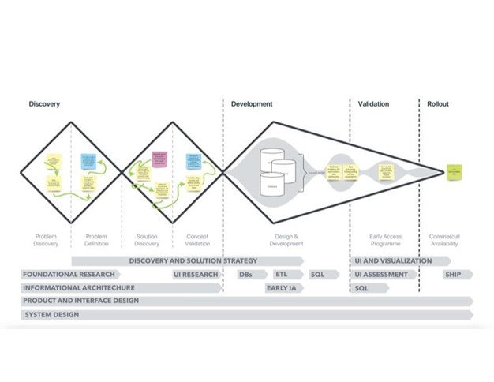
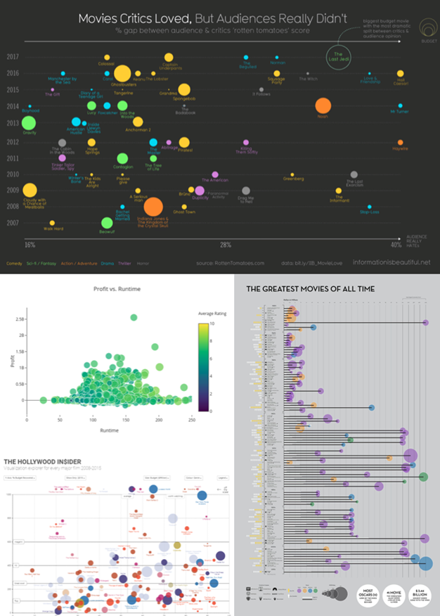

# Movie Recommendations for Domestic and International Flights
**A Data Engineering DE4A Fellowship Project**

**By: Team 13** 

## Business Problem

Airline companies have monetized almost every part of the travel experience, from luggage fees, to higher costs for extra legroom, to in-flight meals, all services that were once included with the price of the flight ticket. However, one service the airline companies have not yet charged are the in-flight movies and TV shows they offer to passengers. Offering digital entertainment is a small perk that keeps passengers entertained, or distracted, during the course of a flight, and almost all carriers offer a catalog of movie and pre-recorded TV options. According to Nerd Wallet, Delta Airlines, for example, can give passengers access to up to 300-movie titles, HBO, Showtime, and 12-channels of live TV.  But of the millions of possible titles to choose from, how do airline executives decide what movies and pre-recorded TV shows to offer on flights? 

The airline industry is elastic; many customers are price-driven and often choose a carrier based primarily on cost of travel to their final destination  Team-13 hypothesizes that in order to help build brand loyalty, airline managers need to make better decisions on the no-cost offerings, such as mood lighting, easy self-service menu options, and a strong catalog of movie and pre-recorded TV offerings. This study will focus on the latter suggestion of entertainment; we will make recommendations to airline executives on what movies and pre-recorded TV shows should be in their digital catalog for short, or regional, flights, cross-country flights, and international flights.   

## Business Impact

Selecting the right mix of titles on flights can save the airline companies a large amount of money in licensing fees. The largest international airlines sometimes pay more than $90,000 USD for the license to show a film over a period of two or three months. In the United States, airliners pay a flat fee every time a movie is watched by a passenger. Some airlines spend up to $20-million USD per year on content.

Team-13 will analyze how movies and TV shows are selected and, where possible, offer the best choices for entertainment selections that can reduce airline cost, increase customer engagement, and provide a better travel experience via entertainment.

## Data

We are planning to use four sets of data:
### 1. Aviation Stack's Real-Time Flights API: 

https://aviationstack.com/documentation

This API provides general global aviation data for real-time and historical flights. Its endpoints include, but are not limited to:
* Flight Status
* Flight Date
* Airline Name
* Flight Number
* Departure City
* Arrival City

Of course, having an API that will provide us with general flight data will be beneficial for this project since we can use this data to determine how long or short flights are. This will, in turn, help us to determine how airliners can better select in-flight entertainment based on the customers’ interests more efficiently.

### 2. Internet Movie Database (IMDb) API: 

https://imdb-api.com/

This is another API that we will use for domain knowledge. It provides general information about films and TV shows. Some of its endpoints are:
* Title
* Release Year
* Content Rating
* Genre
* Critic rating

Like the Real-Time Flights API, having general data about films and TV shows will be beneficial since we can use this data to better select in-flight entertainment based on the customers’ profile and interests.

###  3. Flight Features API: 

https://developer.flightstats.com/api-docs/flightFeatures/v1

According to Cirium, the company behind this API, the Flight Features API offers a highly accurate prediction of amenities on-board every single commercial flight worldwide. It combines datasets of aircraft fleet data from all over the world, flight status data, and flight schedules coupled with machine-based learning capabilities and analytics to deliver highly accurate predictions. In short, we will use this API to see which airline carriers have in-flight entertainment and Wi-Fi.

###  4. Flight Choice Prediction API: 

https://developers.amadeus.com/self-service/category/air/api-doc/flight-choice-prediction

The Flight Choice Prediction API uses Artificial Intelligence and historical flight booking data to identify which flights are most likely to be booked. In other words, this API answers the question of which flights will travelers most likely choose. This will be useful for our project since it provides us details on the type of travelers in each flight. This API has a variable called TravelerType, which tells us if the traveler is an adult, young adult, child, senior citizen, student, a held infant, or a seated infant. The more we know about each passenger, the more we can assist airliners in giving their passengers a more customized travel experience. 

## Methods

Here are some of the key tools and elements of our tech stack that we will like to use for this project. As we continue to build our skills during this program, we hope to add additional tools to this section and improve upon some of our initial assumptions.

### Data Tools

**Data Storage:** We will be utilizing a large number of datasets and files, namely flight datasets and datasets with information about films and TV shows. So we will use an AWS S3 bucket for storage. When we’re ready to clean and transform our data, we will also use S3 to store new datasets that have been created by our data pipelines. Snowflake is another data warehousing tool that we will use to store cleaned data for this project.

**Data Processing:** The majority of our project’s code will be written in Python and SQL. We’ll also likely utilize SparkSQL and PySpark to make it easier to work with these large datasets, especially since we would like to set up and run parallel computing. For data visualization, our team will populate our dashboard by using SQL to pull data from our Snowflake data warehouse.

**Data Orchestration:** Another goal of this project is to ensure that our newly created data pipelines are fully managed and automated. So we will use Apache Airflow, and more specifically, Airflow DAGs, to monitor, schedule, and run PySpark workflows. 

## Interface

The discovery and development path as well as the end-user interface are displayed below. While the initial draft and final product will differ greatly in details offered based on the data uncovered throughout this process, the information offered will enable decision makers to select the best movies based on licensing cost and popularity of the movie. Additionally, the end-user will be able to adjust the findings to better fit geography, distance traveled and time-on-flight.  

## Milestones

We have outlined four different versions of our finished project. Version 1 is the easiest version of our project to complete, with a probability of 100%. Things will get a little bit more challenging with Version 2, with a ~70% probability of completion. We have a ~20% probability of completing project Version 3. And Version 4 will be the most challenging, but most rewarding, version of our project, with only a ~5% probability of completion. So if things go very well for this group, then Version 4 will be the ideal version to complete.

* **Version 1 (100% Probability):** Build a local SQL database to store each cleaned dataset in its own table, along with a set of SQL queries to join the datasets. These datasets will be loaded into a Tableau dashboard.
* **Version 2 (~70% Probability):** Load the uncleaned data sets into an S3 bucket. Python scripts will be triggered by cron jobs running on an EC2 instance that will clean and process the datasets and load them into a data warehouse. Tableau dashboard will pull data directly from the data warehouse via SQL queries. 
* **Version 3 (~20% Probability):** ETL pipelines will be fully orchestrated by Apache Airflow and loaded into a data warehouse on AWS Redshift. Front-end will be an EC2-hosted dash application that queries the data warehouse and visualizes flights and entertainment predictions for different types of passengers.
* **Version 4 (~5% Probability):** All cleaning tasks in ETL pipeline are fully managed and run in containerized processes. Front-end Dash application is replicated and managed by a load balancer to handle users at scale. 

## Concerns
Primary concerns include: (1) Short-staffed. Our team of seven has dwindled down to a team of three and Team-13 has lost domain knowledge that can no longer be leveraged for this project. (2) It’s challenging to find a representative data set or data source with existing airline movies and pre-recorded TV catalogs. (3) Will positive findings actually increase brand loyalty or airline consumer satisfaction?  
